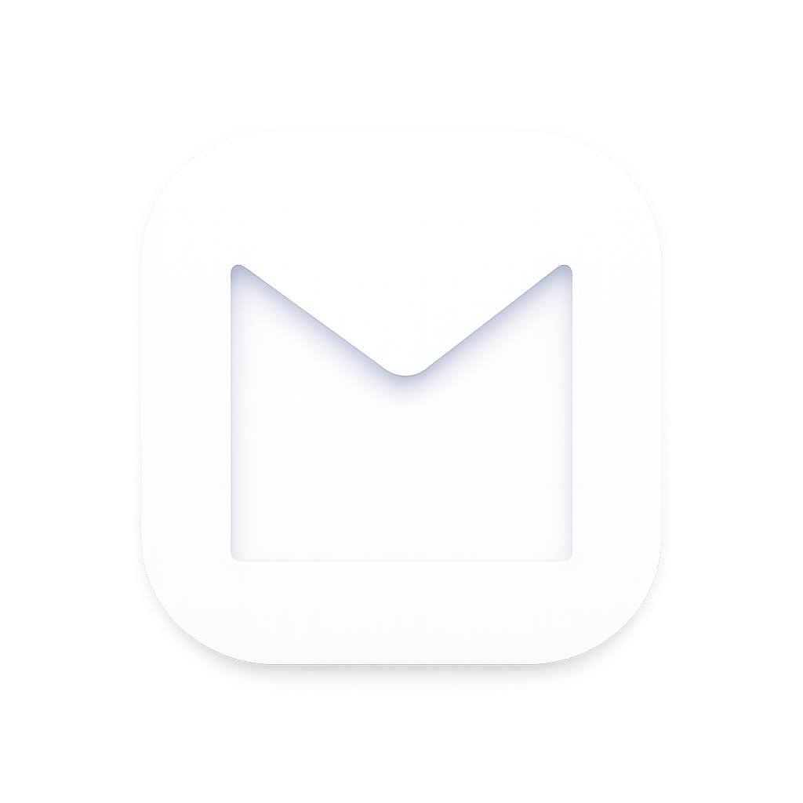

<!-- Replace with your logo asset, e.g. assets/logo.png -->

# Abiat

### Email at the speed of thought.

A fast, secure, native **Gmail & Calendar** desktop client for people who live in their inbox.

**[Download](https://www.abiat.io/download.html)** · **[Website](https://www.abiat.io/)** · **[Releases](https://github.com/abiat-universe/abiat/releases)**

<!-- Replace with a real screenshot, e.g. assets/screenshot.png -->

---

## What is Abiat?

Abiat is a **real desktop app — not another browser tab**. Built with **Tauri and Rust** into a native window, it delivers your Gmail and Calendar with instant launch, frosted-glass vibrancy, and system fonts. It feels like Apple built it.

New mail arrives the instant it lands, your data stays on your device, and everything is driven by the keyboard. Beautifully light or dark.

> **Your inbox stays yours.** It's your inbox — make it fast.

---

## Why Abiat

| | |
|---|---|
| **Native, not a tab** | Built with Tauri and Rust into a real native window — frosted-glass vibrancy, system fonts, and instant launch. |
| **Instant, push mail** | IMAP IDLE pushes new messages the second they arrive — no polling, no waiting. Your inbox is always live the moment you look. |
| **Your data, your device** | Mail is cached locally in SQLite and your tokens live in the OS Keychain. Sign in with Google over OAuth — nothing routes through our servers. |

---

## Features

Designed for people who move fast.

### The workflow — three-pane flow
Sidebar, conversation list, and reading pane — resizable and collapsible. A virtualized list stays smooth across thousands of threads, with unread dots, conversation counts, sorting, and sandboxed HTML rendering.

### Tabs & windows
Open everything in tabs. Pop any one out. Detachable, drag-out windows stay in sync so you can read and compose side by side.

### Compose
Write beautifully, without leaving the keyboard. A rich-text editor with bold, italics, lists, code, links, color, and highlights — plus a full text color & highlight palette, live word/character/line counts, and drag-and-drop attachments.

### Search
Find anyone, and anything, instantly. Full-text search with debounced typing, recent history, people autocomplete, and inline highlighted matches.

---

## Privacy & Security

Your data stays on your device.

- **Local-first** — email and calendar data is fetched directly from Google's servers and cached in a local SQLite database. Abiat never routes your email content through its own servers.
- **OS Keychain** — access tokens are stored in the operating system Keychain.
- **OAuth 2.0 only** — sign in with Google. No passwords are ever stored.
- **Sandboxed rendering** — every email's HTML is rendered in a sandbox.

Read more on the [Security](https://www.abiat.io/security.html) and [Privacy](https://www.abiat.io/privacy.html) pages.

---

## Download

Native for **macOS · Windows · Linux**.

- **macOS** — Apple Silicon & Intel
- **Windows**
- **Linux**

Grab the latest build from the **[Download page](https://www.abiat.io/download.html)** or the **[Releases](https://github.com/abiat-universe/abiat/releases)**.

---

## Tech stack

- **[Tauri](https://tauri.app/)** — native desktop shell
- **[Rust](https://www.rust-lang.org/)** — fast, safe core
- **SQLite** — local mail & calendar cache
- **OAuth 2.0** — secure Google sign-in
- **IMAP IDLE** — instant push mail

---

## Links

- **Website** — https://www.abiat.io/
- **Download** — https://www.abiat.io/download.html
- **Security** — https://www.abiat.io/security.html
- **Privacy** — https://www.abiat.io/privacy.html
- **Terms** — https://www.abiat.io/terms.html
- **License** — https://www.abiat.io/license.html
- **Issues** — https://github.com/abiat-universe/abiat/issues
- **Discussions** — https://github.com/abiat-universe/abiat/discussions

---

## License

Abiat is proprietary software, free to use. See the [License](https://www.abiat.io/license.html) for terms.

© 2026 Abiat · A native Gmail client.

